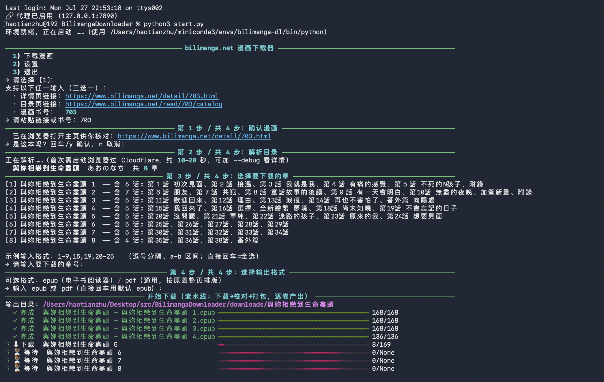
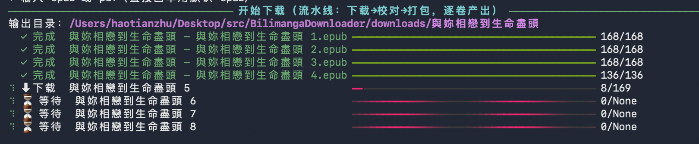

# Bilimanga-Downloader

**English** · [中文](README.md)

A manga downloader for [bilimanga.net](https://www.bilimanga.net/): scrapes the artwork and packages each
volume into **EPUB** or **PDF**.

**Two ways to use it:**

| | CLI (main repo) | 🐵 Userscript ([`userscript/`](userscript)) |
|---|---|---|
| For | comfortable with a terminal; wants pipeline / concurrency / resume | **non-technical users**, zero setup |
| Runtime | Python (`start.py` auto-installs deps) + local Chrome/Edge | **no Python**: install Tampermonkey, then one-click the script |
| Install | `python3 start.py` | install Tampermonkey from the store → click `bilimanga.user.js` to install, auto-updates |
| Platform | macOS / Windows | macOS / Windows (any Chromium/Firefox) |
| Whose CPU | your machine | your machine (script runs same-origin in your own browser) |

> The userscript runs **same-origin inside the bilimanga page**, reusing your **already-passed Cloudflare
> session** — so no environment to install and no cross-origin issues. While you're on a book's detail /
> catalog page, a **"⬇ Download this book" button appears on the right edge**; open it to pick chapters +
> format and download — no pasting URLs, no confirm step.
> **One-click install:** get [Tampermonkey](https://www.tampermonkey.net/), then open [the script](https://raw.githubusercontent.com/zhtinist/Bilimanga-Downloader/main/userscript/bilimanga.user.js) (Tampermonkey pops up the install page). Details in [`userscript/README.md`](userscript/README.md).
> The rest of this page documents the **CLI**.

## Demo (example: book 703《與妳相戀到生命盡頭》)

One command runs the whole flow: confirm → parse catalog → pick chapters → pick format → download & build.



**Each selected volume gets its own progress bar**, moving through
`download → 🔍 validate → 📦 package → ✓ done`. Volumes download one at a time; as soon as a volume
finishes downloading it is validated + packaged in the background (overlapping the next volume's
download), so EPUBs appear one by one:



## Quick start

```bash
python3 start.py
```

`start.py` auto-creates an isolated conda env `bilimanga-dl` (falls back to a project-local `.venv` if
conda is absent — neither pollutes your system), installs deps, then opens the CLI. You can also pass an
argument directly:

```bash
python3 start.py https://www.bilimanga.net/detail/703.html   # detail-page URL
python3 start.py https://www.bilimanga.net/read/703/catalog  # catalog URL
python3 start.py 703                                         # book id
python3 start.py --debug    # debug logging
```

> Want a GUI / zero setup? See the userscript [`userscript/`](userscript) (recommended) or the browser
> extension [`crx/`](crx) — the CLI itself is now terminal-only.

## Flow (CLI, 4 steps)

1. **Confirm** — by default just prints the title in the terminal for a quick check; press Enter / y.
   You can enable "open the page in a browser" in settings for a visual check (the automation browser
   warms up in the background).
2. **Parse catalog** — a real browser passes Cloudflare and scrapes the table of contents.
3. **Pick chapters** — listed as `index + title + which episodes`; type e.g. `1-9,15,19,20-25`
   (Enter = all).
4. **Pick format** — EPUB / PDF, then the download pipeline runs, producing one volume at a time.

## Optimizations / Features

- **Cloudflare bypass** — DrissionPage drives a local Chrome/Edge; a real browser fingerprint passes
  the challenge.
- **3-stage pipeline (download → validate → package)** — volumes download sequentially; the moment a
  volume finishes, validation + packaging run in the background, **overlapping** the next volume's
  download. EPUBs are produced volume by volume; total time ≈ download time.
- **Per-volume progress bars** — pick N volumes → N bars, each showing download / validate / package /
  done at a glance.
- **Adaptive concurrency (sampled every 1 s)** — starts with a few workers and adjusts each second by
  that second's error rate: `0 → +1`, `<40% → −1`, `≥40% → −2` (hard backoff when rate-limited).
  **Shrinking is graceful**: it only lowers the ceiling and never aborts in-flight downloads — busy
  threads finish their current image and simply aren't given new work (no re-downloading, no waste).
- **Lazy-load fix** — reader-page images are injected by JS; the scraper waits for `imagecontent` and
  retries, so later volumes never come up empty.
- **Resume** — temp images live in `temp/download/<title>/<chapter>/`; re-runs skip what's already
  downloaded, and temp is cleaned after packaging.
- **Local validation (offline)** — the validate stage only checks for missing/empty files; gaps are fed
  back to the download stage, no re-crawling.
- **Per-volume cover** — each EPUB's cover is that volume's first image (distinct per volume); series /
  volume metadata is written for reader-app grouping.
- **No special network config** — the browser uses your system's network as-is; only the local CDP
  connection bypasses the proxy (otherwise the tool can't reach the browser when a proxy is on).
- **Mirror fallback / three input forms (detail · catalog · id) / EPUB & PDF** (PDF lays out each image
  full-page, no distortion or padding).

## Layout

```
Bilimanga-Downloader/
├── start.py              # CLI entry point
├── docs/                 # screenshots
├── src/
│   ├── requirements.txt
│   └── bilimanga_dl/     # CLI source (net / scraper / downloader / build_* / cli / ui …)
├── userscript/           # 🐵 userscript build (bilimanga.user.js — zero-setup GUI)
├── config/setting.json   # generated at runtime
├── logs/  temp/  downloads/<title>/   # generated at runtime (gitignored)
```

## Requirements

- **Chrome or Edge** must be installed locally (DrissionPage drives it to pass Cloudflare).
- Other Python deps are in `src/requirements.txt`; `start.py` installs them automatically.

> For personal study / backing up public content only. Please respect the site's terms.
